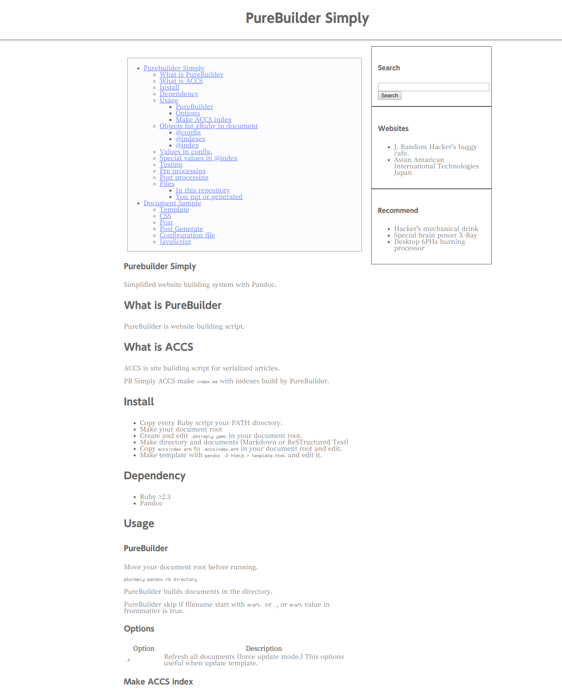

# Purebuilder Simply

簡素化されたPandocを使ったウェブサイト構築システム。

## PureBuilderとは

PureBuilder Simplyはウェブサイト構築スクリプトである。

## ACCSとは

ACCSはウェブサイト上で連載を構築するためのスクリプトである。

PureBuilder Simply ACCS はPureBuilder Simplyによって `index.html` ファイルを生成する。

## インストール

### RubyGems.orgからインストールする

`gem install pbsimply`

### 手動でRubyGemsをインストールする

* `gem build pbsimply.gemspec`
* `gem install pbsimply-$version.gem`

### 手動でインストールする

* `git clone https://github.com/reasonset/purebuilder-simply`
* `bin/`ディレクトリのファイルをPATHの通ったディレクトリにコピーする
* `lib/`ディレクトリのファイルをRubyライブラリのディレクトリにコピーする

## はじめる

* ドキュメントルートディレクトリを作成する
* ドキュメントルートディレクトリに `.pbsimply.yaml`ファイルを設置する
* ディレクトリ及びドキュメント(MarkdownまたはReST)を書く
* `pandoc -D html5 > template.html` としてテンプレートファイルを作成し、編集する

## Dependency

* Ruby >= 3.0
* Pandoc >= 2.8

## Usage

### PureBuilder

ドキュメントルートに移動してから次のように実行する。

	pbsimply directory

PureBuilder Simplyはdirectoryにあるドキュメントを構築する。

構築されるドキュメントから除外したい場合、ファイル名を`draft-`または`.`ではじまるものにするか、
frontmatterの`draft`の値を真にする。

### Options

|オプション|内容|
|------|------------------------------|
|`-f`, `--force-refresh`|すべてのドキュメントを強制的に更新する。テンプレートを更新した場合に便利|
|`-I`, `--skip-index`|`.indexes.rbm`に登録しない|
|`-A`, `--skip-accs`|ACCSの処理をしない|
|`-o FILE`, `--output`|出力ファイルをFILEに指定する|
|`-m FILE`, `--additional-metafile`|さらに追加のメタデータYAMLファイル|

### Make ACCS index

`pbsimply`は自動的にACCSドキュメントディレクトリを発見し、処理する。
あなたは`.accs.yaml`ファイルをディレクトリに配置することで、そのディレクトリがACCSドキュメントディレクトリであることを示すことができる。

ACCSプロセッサは`index.html`を生成し、配置する。

## eRubyで利用できるオブジェクト

テンプレートまたは生成されたドキュメントでeRubyを使うことができる。

eRubyでは次のオブジェクトが利用できる。

### @config

Loaded config YAML file (`.pbsimply.yaml`).

### @indexes

コンパイルされたインデックスデータベース。

このオブジェクトは`pbsimply`の途中で実行される場合、不完全である可能性が高い。

### @index

"default | indexed | frontmatter | current"にあるドキュメントメタデータ。

### インデックスデータベース

ドキュメントメタデータは各ドキュメントディレクトリ上のデータベースに保存される。

デフォルトでは`.indexes.rbm`という名前のRuby Marshalファイルとして保存される。

設定ファイルの`dbstyle`の値として`json`あるいは`oj`を設定すると、
Ruby Marshalの代わりにJSONが使用され、ファイル名も`.indexes.json`になる。

## 設定ファイルの値

|Key|Type|Description|
|-------|-----|---------------------|
|outdir|String|出力先ベースディレクトリ。必須|
|template|String|Pandoc HTMLテンプレートファイル。 `temaplte.html`がデフォルト|
|css|String / Array|CSSファイル|
|toc|Boolian|真ならばTOCを生成する|
|pandoc\_additional\_options|Array|追加で渡されるPandocのコマンドラインオプション|
|post\_eruby|Boolean|真にするとPandocの出力をerbによってプロセッシングする|
|alt\_frontmatter|Hash|ACCSインデックスファイルのデフォルトのfrontmatter|
|default\_meta|Hash|デフォルトのfrontmatter|
|testserver\_port|Fixnum|`pbsimply-testserver`が使用するポート(default 8000)|
|self\_url\_prefix|String|生成されたドキュメントのURLの絶対パスのプレフィックス部。デフォルトは`/`|
|self\_url\_external\_prefix|String|`self_url_prefix`の`page_url_encoded_external`用|
|dbstyle|String|`json`に設定すると`.indexes.rbm`に代えて`.indexes.json`が使用される。さらに`oj`に設定した場合、`JSON`ライブラリではなく`Oj`ライブラリを使用する|
|bless\_style|String|`cmd`の場合、Ruby Procを使用する通常のblessではなくコマンドを使用する|
|bless\_cmd|String / Array|blessに使用するコマンド|
|bless\_accscmd|String / Array|ACCSのblessに使用するコマンド|
|blessmethod\_accs\_rel|String|「次」「前」の記事を探索する自動blessメソッド|
|auto\_delete|Boolean|ソースドキュメントが消えた場合、出力ドキュメントからも削除する|
|detect\_modification|String|更新の検出方法。`changes`は`changes`ヘッダーの変更から検出する。`mtimesize`はmtimeとファイルサイズから検出する。 これ以外の場合、mtimeで検出する|
|pandoc\_command|String|Pandocのコマンド。デフォルトは`pandoc`|
|jsonout|Boolean|真である場合、JSON形式で出力する|
|jsonout_include|String[]|`jsonout`で出力されるJSONに含むfrontmatterのキーの配列。この設定は`jsonout_exclude`より優先される|
|jsonout_exclude|String[]|`jsonout`で出力されるJSONから除外されるfrontmatterのキーの配列|

## 特別な値

|Key|Set by|Used by|Description|
|-------|------------|------------|-----------------------------------|
|title|frontmatter|frontmatter|文書タイトル。必須|
|author|frontmatter|frontmatter|著者|
|date|frontmatter/system|frontmatter or system.|執筆日|
|lang|frontmatter|additional option / Pandoc template|`lang`/`xml:lang`|
|keywords|frontmatter|additional option / Pandoc template|An array, HTML metaタグのキーワードとして使うもの|
|description|frontmatter|additional option / Sample template|HTML metaタグのdescriptionとして使うもの|
|draft|frontmatter|additional option / system|草稿。真である場合プロセッシングから除外される|
|\_last\_proced|system|system|*Integer*. 最後にPureBuilderで処理された時刻。. はじめてのプロセッシングの場合(あるいはデータベースを削除した場合)`0`になる|
|last\_updated|system|system|*String*. 最後にPandocで生成した時刻|
|\_size|system|system|ファイルサイズ (byte)|
|\_mtime|system|system|*Integer*. mtime of this file.|
|\_filename|system|system|ファイル名|
|\_docformat|system|system|Document Format. `Markdown` or `ReST`.|
|categories|frontmatter|ACCS|ドキュメントのカテゴリ。ACCSによって使われる|
|pagetype|frontmatter/config|ACCS|ページタイプ。デフォルトは`post`。ACCSによって生成されるインデックスページは`accsindex`|
|source\_directory|system|system|ソースディレクトリ|
|source\_file|system|system|ソースファイル名|
|source\_path|system|system|ソースファイルパス|
|dest\_path|system|system|出力ファイルパス|
|normalized\_docdir|system||`/`で始まる正規化されたソースディレクトリ|
|normalized\_docpath|system||`/`で始まる正規化されたドキュメントパス|
|page\_url|system||当該ドキュメントの生成後のURL|
|page\_url\_encoded|system||当該ドキュメントの生成後のURLのURIエンコードされたもの|
|page\_url\_encoded\_external|system||`page_url_encoded`で`self_url_external_prefix`を使うもの|
|page\_html\_escaped|system||当該ドキュメントの生成後のURLのHTMLエンコードされたもの|
|page\_html\_escaped\_external|system||`page_html_encoded`で`self_url_external_prefix`を使うもの|
|title\_encoded|system||タイトルをURIエンコードしたもの|
|title\_html\_escaped|system||タイトルをHTMLエスケープしたもの|
|timestamp|frontmatter|frontmatter / system|`date`よりも詳細なドキュメントの日時を記載する項目|
|timestamp\_xmlschema|system|system|XMLスキーマでフォーマットされたドキュメント日時。`timestamp`が定義されていない場合、`date`を使う|
|timestamp\_jplocal|system|system|日本のローカル形式でフォーマットされたドキュメント日時。`timestamp`が定義されていない場合、`date`を使う|
|timestamp\_rubytimestr|system|system|Rubyの`Time#to_s`のようなフォーマットされたドキュメント日時。`timestamp`が定義されていない場合、`date`を使う|
|timestamp\_str|system||`%Y-%m-%d[ %H:%M:%S %Z]`形式の日時。 `timestamp`が定義されていない場合、`date`を使う|

## 環境変数

Pre Plugins, Post plugins, Blessing command, Hooksにおいて利用できる環境変数

|変数|Pre|Post|Bless|説明|
|---------|---|---|---|--------------------|
|`pbsimply_outdir`|Yes|Yes|Yes|Yes|Yes|出力先ドキュメントルートのパス|
|`pbsimply_subdir`|Yes|Yes|Yes|Yes|Yes|ドキュメントルートからのドキュメントディレクトリのパス|
|`pbsimply_indexes`|Yes|Yes|Yes|Yes|Yes|インデックスデータベースのファイルパス|
|`pbsimply_frontmatter`|Yes|Yes|Yes|Yes|Yes|現在のドキュメントのfrontmatter(JSON)のパス|
|`pbsimply_working_dir`|Yes|Yes|Yes|Yes|Yes|処理中のファイルが置かれているディレクトリ|
|`pbsimply_currentdoc`|Yes|Yes|No|No|No|処理中のドキュメントファイルのパス|
|`pbsimply_filename`|Yes|Yes|No|No|No|元々のソースファイルのファイル名|

## Testing

ドキュメント中のリンクはローカルな場所に **すべきではなく** 、 *web上のURLでなくてはいけない* 。
そのため生成したファイルを静的にテストすることはできない。

ドキュメントルートで`pbsimply-testserver`を実行すると、テストサーバーを稼働させる。

使い方はとても簡単。

1. ドキュメントルートに移動する
2. 起動する
3. `http://localhost:port` にアクセスする

ポートは設定ファイルの`testserver_port`で設定でき、デフォルトは8000。

もし`http://example.com/site/index.html`のように本番環境がサブディレクトリにある場合、
ドキュメントをサブディレクトリ化に配置することを推奨する。

## 祝福

### Rubyで祝福する

`.pbsimply-bless.rb`というRubyスクリプトファイルを使うことでFrontmatterに手を加えることができる。

これを使用したい場合、同ファイルで`PureBuilder::BLESS` Procオブジェクトを定義する。
このオブジェクトは`PureBuilder::BLESS.call(frontmatter, self)`のように呼び出される。

呼び出されるタイミングはシステムによってセットされる値が全てセットされた後である。

この関数は値を返す必要はなく、引数として渡されたFrontmatter Hashオブジェクトを直接変更できる。

もしも処理中のディレクトリがACCSドキュメントディレクトリである場合、`PureBuilder::BLESS`のあとでさらに`PureBuilder::ACCS::BLESS`も(定義されていれば)呼び出される。

さらにあなたは`PureBuilder::ACCS::DEFINTIONS` Hashに対して`Proc`値を追加することができる。
これらは特別な値のために使用される。

|Key|動作|
|-----|-------------------------|
|`:next`|戻り値を`frontmatter["next_article"]`にセットする|
|`:prev`|戻り値を`frontmatter["prev_article"]`にセットする|

一例として、次に示すのは[Chienomi](https://chienomi.org/)のblessing scriptである。

```ruby
#!/usr/bin/ruby

load "./.lib/categories.rb"

TOPICPATH = {
  "" => ["TOP", "/"],
  "/articles" => ["Articles", "/#Category"],
  "/override" => ["Override", "/"],
  "/archives" => ["Old Archives", "/articlelist-wp.html"]
}

ARTICLE_CATS.each do |k,v|
  TOPICPATH[["/articles", k].join("/")] = [v, ["", "articles", k, ""].join("/")]
end

PureBuilder::BLESS = ->(frontmatter, pb) {
  content = nil
  filetype = nil
  content = File.read(frontmatter["source_path"])
  filetype = File.extname(frontmatter["_filename"])

  url = frontmatter["page_url"].sub(/^\.?\/?/, "/")
  frontmatter["topicpath"] = []
  url = url.split("/")
  (1 .. url.length).each do |i|
    path = url[0, i].join("/")
    if v = TOPICPATH[path]
      frontmatter["topicpath"].push({"title" => v[0], "url" => v[1]})
    else
      frontmatter["topicpath"].push({"title" => frontmatter["title"]})
      break
    end
  end

  if frontmatter["category"] && url.include?("articles")
    frontmatter["category_spec"] = [ARTICLE_CATS[url[-2]], frontmatter["category"]].join("::")
  end

  if content
    if((filetype == ".md" && content =~ %r:\!\[.*\]\(/img/thumb/:) || (filetype == ".rst" || filetype == ".rest") && content =~ %r!\.\. image:: .*?/img/thumb!)
      frontmatter["lightbox"] = true
    end
  end
}

article_order = nil
rev_article_order_index = {}

PureBuilder::ACCS::BLESS = -> (frontmatter, pb) {
  frontmatter["ACCS"] = true
  unless article_order
    article_order = pb.indexes.to_a.sort_by {|i| i[1]["date"]}
    article_order.each_with_index {|x,i| rev_article_order_index[x[0]] = i }
  end
}

PureBuilder::ACCS::DEFINITIONS[:next] = ->(frontmatter, pb) {
  index = rev_article_order_index[frontmatter["_filename"]] or next nil
  if article_order[index + 1]
    {"url" => article_order[index + 1][1]["page_url"],
     "title" => article_order[index + 1][1]["title"]}
  end
}

PureBuilder::ACCS::DEFINITIONS[:prev] = ->(frontmatter, pb) {
  index = rev_article_order_index[frontmatter["_filename"]] or next nil
  if index > 0
    {"url" => article_order[index - 1][1]["page_url"],
     "title" => article_order[index - 1][1]["title"]}
  end
}
```

### 他の言語、あるいはコマンドで祝福する

設定ファイルの`bless_style`の値として`cmd`をセットすると、Ruby Procの代わりに外部コマンドによって祝福を行う。

`bless_cmd`は通常の祝福用、
`bless_accscmd`はACCSの祝福用である。

いずれの場合も環境変数`$PBSIMPLY_WORKING_DIR`のディレクトリにある`pbsimply-frontmatter.json`ファイルからドキュメントメタデータを読み取ることができ、同ファイルを書き換えることで変更を反映することができる。

### 自動的な祝福

いくつかの設定は自動的に予め用意されたメソッドで祝福する。

#### ACCSの前後関係

`blessmethod_accs_rel`は`next_article`と`prev_article`を設定する。
これらは`url`と`title`からなる連想配列である。

`numbering` (ファイル名先頭の数値), `lexical` (ファイル名辞書順), `date`, `timestamp`が用意されている。

## ファイル

### リポジトリに含まれるもの

|Filename|Description|
|--------|-------------|
|pbsimply-testserver|テスト用ウェブサーバー起動スクリプト|
|accsindex.erb|`.accsindex.erb`のサンプル。通常編集せずそのまま利用できる|

### あなたが置くか、生成されるもの

|ファイル名|場所|Description|
|--------|-----------|-------------|
|.pbsimply.yaml|root|設定ファイル。ドキュメントルートに置く|
|.indexes.rbm|each|PureBuilder Simplyが生成するRuby marshalファイルのインデックスデータベース|
|.indexes.json|each|PureBuilder Simplyが生成するJSONファイルのインデックスデータベース|
|.index.md|each|ACCSが生成するインデックスページ|
|.accsindex.erb|root or each ACCS|ACCSインデックスページ用Markdown eRubyテンプレート|
|.accs.yaml|each|ACCSインデックスページ用の`@index`|
|.pbsimply-bless.rb|root|Bless用のRubyスクリプト|

# ドキュメントサンプル

## テンプレート

このテンプレートは標準的なブログをイメージしたテーマとなっている。

* ふたつのヘッダーを持つ。通常は`display: none`になっているバナーのための`#TopHeader`と、タイトルのための`#TitleHeader`
* メインセクションは`#MainContainer` sectionで囲まれる
* 記事は`#MainArticle` articleに囲まれる
* サイドバーは`#SideBar` sectionとして容易されている。include beforeを使ってサイドバーの中身を書くことができる
* 著者部分は削除された
* 埋め込みCSSは削除された
* シンタックスハイライトのテーマも削除された。必要なら[pandoc-goodies](https://github.com/tajmone/pandoc-goodies)などで入手できる。

## CSS

基本的でシンプルなCSSが用意されている。

|ファイル|内容|
|---------|----------------|
|layout.css|レイアウト|
|base.css|最小限のデザイン|
|skylightning.css|PandocデフォルトのソースコードCSS|
|lightbox.css|Lightboxプラグインのテーマ|

## Post

ACCSのベースになるディレクトリ。

## Post Generate

post-pluginsのサンプルスクリプト

## 設定ファイル

`.accsindex.rb` と `.pbsimply.yaml` のサンプルファイルが用意されている。

## JavaScript

JavaScriptプラグインファイル。

それぞれのファイルにあるREADMEを読むこと。

## テーマ

コピーしたサンプルドキュメントディレクトリにテーマディレクトリをマージすることでテーマを利用することができる。

### Base



### Warm


### Practical


### Bloggy

]

## Pandoc以外のプロセッサを使う

### 基本事項

PureBuilder SimplyはPandocを使うことで非常に強力なツールとなるが、Pandocを好まない場合、他のドキュメントプロセッサを使うこともできる。

ただし、機能的には制約を受ける。

使用するプロセッサは`.pbsimply.yaml`の`pbsimply_processor`の値を用いて指定する。

|Processor|pbsimply_processor|
|--------|-------------------|
|RDoc|`rdoc`|
|RDoc/Markdown|`rdoc_markdown`|
|Kramdown|`kramdown`|
|Redcarpet|`redcarpet`|
|CommonMarker (cmark-gfm)|`cmark`|
|Docutils (実験的)|`docutils`|

また、テンプレートをeRubyテンプレートとして評価するものについては、テンプレート上で次の値を利用することができる
(ほとんどの場合、`frontmatter`と`article_body`を使う)。

|変数名|内容|
|--------|--------------------------|
|`dir`|ドキュメントルートからの相対ディレクトリ|
|`filename`|ソースファイル名|
|`frontmatter`|blessの行われたメタデータ|
|`orig_filepath`|処理対象のもとのファイルパス|
|`procdoc`|ソースとして実際に処理されているファイルパス|
|`article_body`|生成されたHTMLドキュメント|

### RDoc

#### 説明

Rubyの標準ドキュメントシステムのRDocを用いる。
ソースファイルはRDocであるとして処理し、対象は`*.rdoc`ファイルに限られる。

テンプレートはeRubyテンプレートとして扱う。

#### Dependency

* rdoc library

#### 使用できない設定

* `css`
* `toc`
* `pandoc_additional_options`
* `post_eruby`

### RDoc/Markdown

#### 説明

Rubyの標準ドキュメントシステムのRDocのMarkdownプロセッサを用いる。
ソースファイルはMarkdownであるとして処理し、対象は`*.md`ファイルに限られる。

テンプレートはeRubyテンプレートとして扱う。

#### Dependency

* rdoc library

#### 使用できない設定

* `css`
* `toc`
* `pandoc_additional_options`
* `post_eruby`

### Kramdown

#### 説明

RubyのMarkdownライブラリ、Kramdownを用いて生成する。
ソースファイルはMarkdownであるとして処理し、対象は`*.md`ファイルに限られる。

テンプレートはeRubyテンプレートとして扱う。

#### Dependency

* kramdown library

#### 使用できない設定

* `css`
* `toc`
* `pandoc_additional_options`
* `post_eruby`

#### 追加される設定

|Key|Type|Description|
|-------|-----|-----------------------|
|`kramdown_features`|Hash|`Kramdown::Document.new`の第2引数として渡される連想配列。詳細は[APIドキュメントを参照すること。](https://kramdown.gettalong.org/rdoc/Kramdown/Options.html)|

### Redcarpet

#### 説明

RubyのMarkdownライブラリ、Redcarpetを用いて生成する。
ソースファイルはMarkdownであるとして処理し、対象は`*.md`ファイルに限られる。

テンプレートはeRubyテンプレートとして扱う。

#### Dependency

* redcarpet library

#### 使用できない設定

* `css`
* `toc`
* `pandoc_additional_options`
* `post_eruby`

#### 追加される設定

|Key|Type|Description|
|-------|-----|-----------------------|
|`redcarpet_extensions`|Hash|Redcarpetの拡張を示す連想配列。詳細は[Redcarpetのページ](https://github.com/vmg/redcarpet)を参照|

### CommonMarker

#### 説明

`libcmark-gfm`のRubyラッパーであるCommonMarkerを用いて生成する。
ソースファイルはMarkdownであるとして処理し、対象は`*.md`ファイルに限られる。

`table`及び`strikethrough`拡張が有効になる。

テンプレートはeRubyテンプレートとして扱う。

#### Dependency

* libcmark-gfm
* commonmarker library

#### 使用できない設定

* `css`
* `toc`
* `pandoc_additional_options`
* `post_eruby`

### Docutils

#### 説明

Pythonで書かれたReSTructured Textプロセッサ、Docutilsを用いて生成する。
ソースファイルはReSTructured Textであるとして処理し、対象は`*.rst`ファイルに限られる。

#### Dependency

* Docutils (`rst2html5`)

#### 使用できない設定

* `toc`
* `pandoc_additional_options`

#### 追加される設定

|Key|Type|Description|
|-------|-----|-----------------------|
|`docutils_options`|Array|`rst2html5`コマンドに渡されるコマンドラインオプション引数|

# Hooks

## 概要

Hooksを使うことで、PureBuilder Simplyの処理に追加の挙動を加えることができる。

Hooksを定義するには、ドキュメントルートディレクトリに`.pbsimply-hooks.rb`を置く。
このスクリプトでは、`PBSimply::Hooks.load_hooks`を定義する必要がある。

このメソッドには`PBSimply::Hooks`オブジェクトが引数として渡される。
`PBSimply::Hooks`オブジェクトはタイミングをメソッドとして持っており、それぞれのタイミングオブジェクトの`<<`メソッドに`Proc`オブジェクトを渡すことで、hookに処理を追加することができる。

```ruby
#!/bin/ruby

def (PBSimply::Hooks).load_hooks h
  h.process << ->(v) {
    db[v["normalized_docpath"]] = v
  }

  h.post << ->(v) {
    db.delete_if do |dbk, dbv|
      not File.exist? dbv["dest_path"]
    end
  }
end
```

hookには必ず1つの引数(通常はHash)が渡されるが、その中身はタイミングによって異なる。

## タイミングメソッド

`PBSimply::Hooks#load_hooks`の引数オブジェクトのメソッド。

### `#add {|arg| ... }`

ブロックをタイミングオブジェクトに追加する。

### `#<< proc`

Procオブジェクトをタイミングオブジェクトに追加する。

### `#cmd(*cmdarg)`

`system(*cmdarg)` 形式でコマンドを実行する。

`pre`では`$pbsimply_currentdoc`の内容を更新して反映させることができる。

### `#filter(*cmdarg)`

`IO.popen(cmdarg, "w+")` 形式でコマンドを実行する。

コマンドは標準入力からドキュメントの内容が与えられ、ドキュメントの内容はコマンドの出力で置き換えられる。

このコマンドは`pre`においてのみ利用可能。

## タイミングオブジェクト

### pre

`PBSimply::Hooks#pre`はドキュメント処理の直前に呼ばれる。

引数は`frontmatter`と`procdoc`.

`frontmatter`はこのタイミングでのfrontmatterが入っている。
`pre`が呼ばれるのはBLESSよりも後である。

`procdoc`には処理中のドキュメントの一時ファイルのパスが入っている。
この時点では、このファイルの中身はソースドキュメントからfrontmatterを除いたものに過ぎない。

### process

`PBSimply::Hooks#process`はドキュメントの一連の処理を行い、最後の生成を行った直後に呼ばれる。

引数は`frontmatter`, `procdoc`, `outpath`である。

`frontmatter`および`procdoc`は`#pre`と同様だが、生成前の処理はすべて終わった状態になっている。
`outpath`は出力予定されたドキュメントのパス。

### delete

`PBSimply::Hooks#delete`は、ドキュメントが「なくなった」場合に呼ばれる。
これは、ドキュメントがdraftに変更された場合を含む。

引数は`target_file_path`と`source_file_path`である。

`target_file_path`はこのドキュメントが生成される場合の出力ファイルパスである。
このファイルは存在する場合もあれば、存在しないこともある。

`source_file_path`はソースドキュメントのパスである。
存在することもあれば、存在しないこともある。

### post

`PBsimply::Hooks#post`はすべてのドキュメントの生成が終わったタイミングで呼ばれる。

引数は`this_time_processed`である。
これは、`Hash`の配列で、実際にPureBuilder Simplyが今回の処理したドキュメントが入っている。
中身は`source`(オリジナルのソースファイルのパス), `dest`(出力ファイルのパス), `frontmatter`である。

### accs

`PBSimply::Hooks#accs`はACCSインデックスを生成するときに呼ばれる。

引数として`index`と`indexes`が渡される。
これは、`.accsindex.erb`で認識される`@index`および`@indexes`と同じものである。